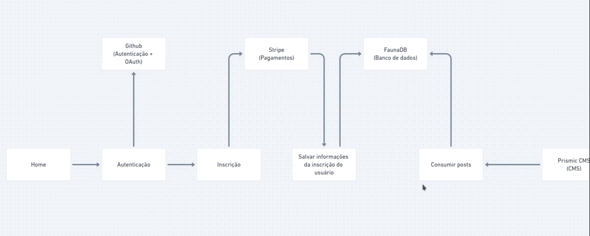
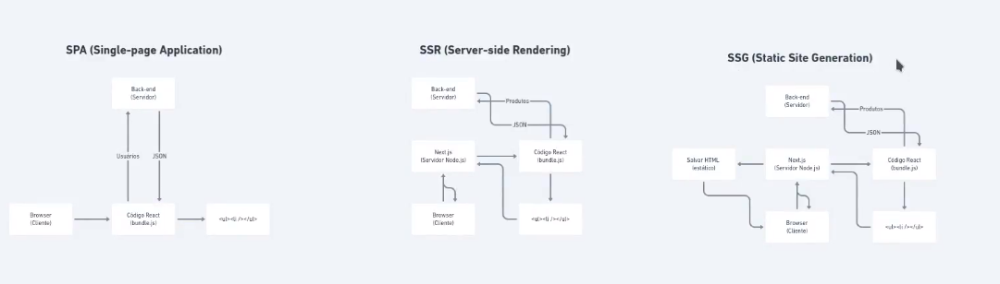

## IGNews - Fluxo da aplicação

Aplicação de conecta com diferentes APIs para implementar diferentes funcionalidades:

- Autenticação (GitHub 0Auth) - https://auth0.com/pt
- Stripe (Api para pagamentos online) - https://stripe.com/docs/api
- FaunaDB (Banco para salvamento das informações do usuário) - https://fauna.com/

## Tecnologias utilizadas

- Nextjs (estrutura base da aplicação)
- SASS - Estilização -> escolhida à título de conhecimento

## NEXT - formas de fazer chamadas a API -> popular a página com informações

- Client-side : Ex: fetch(), axios no componente, faz a chamada pelo lado do cliente: requisição HTTP;

Quando: outros casos; informação que não precisam ser carregadas quando a página for montada, ou seja, dados que só serão carregados após uma determinada ação do usuário ou algum evento específico

- Server-side:  Faz a chamada no servidor nodejs do next. Chamada HTTP através do server side rendering  (Servidor Node.js do Next) ao invés de realizar no browser.

Isso garante que a aplicação já será renderizada contendo os dados da API, que pode ser mais lenta que a construção da página pelo browser [ layout shift ].

Quando: São necessários dados dinâmicos da sessão do usuário. informações em tempo real

-  Static side generation: É uma forma de otimizar aplicações que possuem páginas estáticas => que serão mostradas da mesma forma pra atodos aqueles que a acessarem. 

Quando: home de um blog, página de um produto em um e-commerce; Útil para casos em que o HTML construído vai ser mostrado da mesma forma para todos os usuários que o acessarem.

  